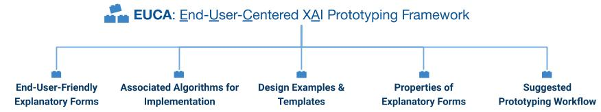
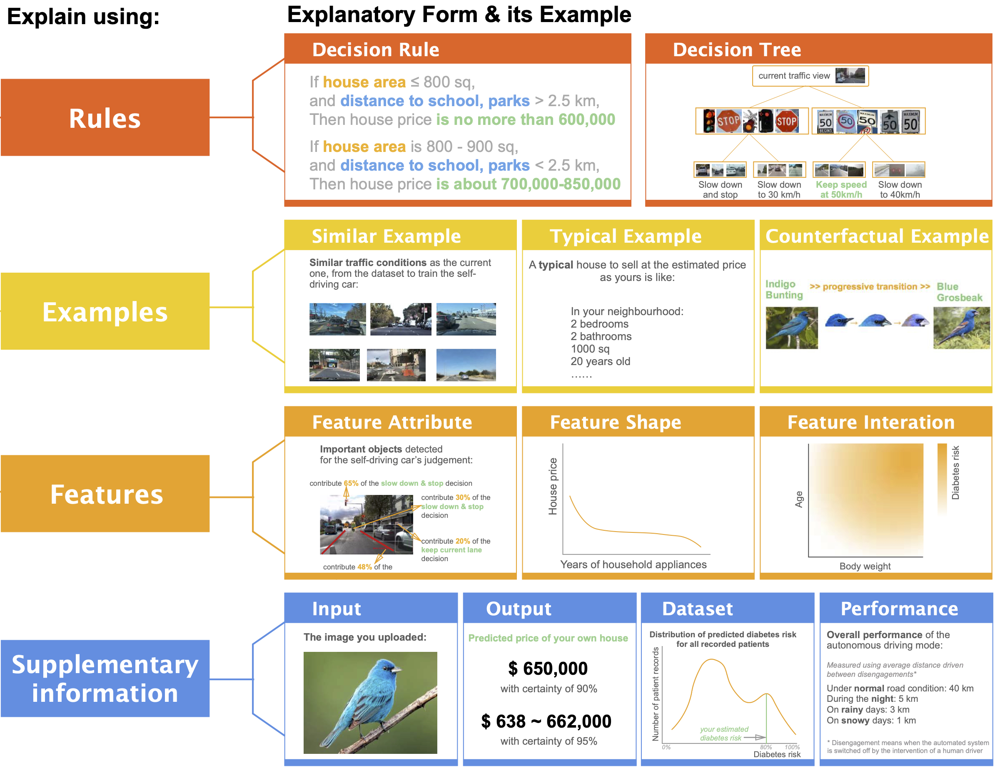
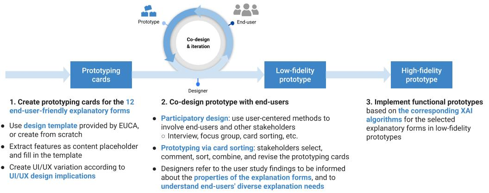

# EUCA: <ins>E</ins>nd-<ins>U</ins>ser-<ins>C</ins>entered Explainable <ins>A</ins>I Framework
The EUCA framework is a prototyping tool to design explainable artificial intelligence for non-technical end-users.

It can help you quickly build a low-fidelity explainable AI (XAI) prototype, and implement it as a functional one. 

You can use the prototype at the initial phase for user need assessment, and as a start for your explainable AI system iteration.

# Why explainable AI?

As AI is getting pervasive and assists users in making decisions on **critical tasks**, such as autonomous driving vehicles, clinical diagnosis, financial decisions, legal and military judgment, or something crucial that relates to people's life or money, the end-users will be more likely to require AI to justify its prediction.

Making AI explainable to its end-users is challenging, since end-users are **laypersons** or **domain experts**, and they do not have technical knowledge in AI or computer science to understand how AI works.

# Who use EUCA?
EUCA can be used by **anyone who designs or builds** an explainable AI system **for end-users**, such as UI/UX designers, AI developers, AI researchers, and HCI researchers. 

# What is the EUCA framework?

The main component of EUCA is the **12 end-user-friendly explanatory forms**, and
- their associated design examples/templates
- corresponding algorithms for implementation, and 
- identified properties (their strength, weakness, UI/UX design implications, and applicable explanation needs) from our user study findings 
See **[explanatory forms page](explanatory_form.md)** for the above details and design examples.

In addition, EUCA also provides a [suggested prototyping method](#prototyping), and end-users' diverse **[explanation need analysis](need.md)** (such as to [calibrate trust](need.md/#trust), [detect bias](need.md/#bias), [resolve disagreement with AI](need.md/#unexpected)).

The 12 explanatory forms in EUCA framework are:
## Feature-based explanation
1. [Feature attribute](explanatory_form.md/#fa)  
2. Feature shape
3. Feature interaction

## Example-based explanation
4. Similar example
5. Typical example
6. Counterfactual example

## Rule-based explanation
7. Rule text
8. Decision tree

## Supplementary information
9. Input
10. Output
11. Performance
12. Dataset

#  How to use EUCA for XAI prototyping?

## Step 1: Think about your input and feature data type
The input data and feature format need to be human-understandable, so that end-users can interpret the explanations which are formed by features, examples, or rules.

## Step 2:  Get familiar with the end-user-friendly explanatory components 
There are 12 end-user-friendly explanatory types in the EUCA framework. They are grouped into four categories: explaining using features, examples, rules, and supplementary information. The explanatory types are building blocks, and you can combine them to construct your end-user-oriented XAI prototype.
The components in the EUCA framework are introduced [here](#framework).

## Step 3:  Create your explanatory component cards

Our [design templates](#template) contain the 12 explanatory components, each one is presented on a card. You can adopt the explanatory components to your task, and regarded them as individual components of your explainable AI prototype. 

For one explanatory component, you may prepare multiple versions varying its visual design, layout, the degree of details, etc. You may get more inspirations from the **design implication** part of each explanatory component. 

## Step 4: Talk to your end-users or other stakeholders, select and combine the explanatory components to construct your prototype
The EUCA framework can facilitate your participatory design process, i.e., to involve end-users or other stakeholders in the software development lifecycle. You can use the prepared explanatory component cards to discuss with your users about their needs for explainability. Sometimes the purposes to check explanations vary from calibrating trust with the AI system, to verifying the decisions from AI, to improving the predicted outcomes. And the demands for explainability may be distinct for different explanatory purposes. In your discussion, your users can select, combine, and arrange the explanatory cards to form a paper-based prototype that fulfills their needs under different purposes of checking explanations. 

## Step 5: Deploy and iterate the prototype
We list the corresponding algorithms after each explanatory component, so that you can implement them or use the existing open-sourced implementation to deploy your XAI prototype. You can iterate your XAI system based on the implemented working prototype. 

#  Prototyping materials for download
We provide the following prototyping materials:
1. Templates: Blank cards card grids with their explanatory type name
2. Examples: We demonstrate creating prototype for tabular or sequential input, and for image input respectively. 
* **House**: House price prediction. Tabular
* **Health** : Diabetes risk prediction. Sequential or tabular input
* **Car**: Self-driving car. Image or video input
* **Bird**: Bird species recognition. Image input

We have the following versions:
- [Sketch file]()
- [PDF print version]()      
- [PowerPoint]() 
- [Google slides]()

You can create your own or even draw your explanatory cards on paper.  We provide some examples on tabular and image input data for your reference.

#  How to cite the EUCA framework?
[Research paper]()

#  I used EUCA and I want to share my XAI design

You can inspire other designers by sharing your sketches, designs and prototypes using EUCA. We will post your design on the EUCA page.

To share your design, please feel free to contact weinaj at sfu dot ca, or open a pull request on the [EUCA project repo](https://github.com/weinajin/end-user-xai).

