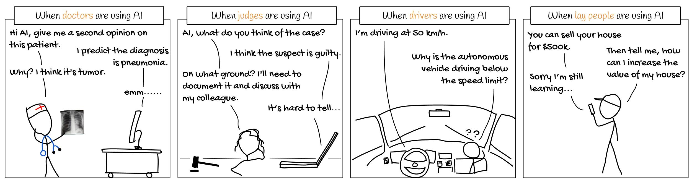

# EUCA: <ins>E</ins>nd-<ins>U</ins>ser-<ins>C</ins>entered Explainable <ins>A</ins>I Framework


The EUCA framework is a **prototyping tool** to design explainable artificial intelligence for non-technical end-users.

It can help you build a low-fidelity explainable AI (XAI) prototype, so that you can use it to quickly "trial and error" (without the effort to implement it), and co-design and iterate it together with your end-users.


You can use the prototype at the initial phase for user need assessment, and as a start for your explainable AI system iteration.

# Why explainable AI?




As AI is getting pervasive and assists users in making decisions on **critical tasks**, such as autonomous driving vehicles, clinical diagnosis, financial decisions, legal and military judgment, or something crucial that relates to people's life or money, the end-users will be more likely to require AI to justify its prediction.

Making AI explainable to its end-users is challenging, since end-users are **laypersons** or **domain experts**, and they do not have technical knowledge in AI or computer science to understand how AI works.

# Who use EUCA?
EUCA can be used by **anyone who designs or builds** an explainable AI system **for end-users**, such as UI/UX designers, AI developers, AI researchers, and HCI researchers. 

---

# What is the EUCA framework?


The main component of EUCA is the **12 end-user-friendly explanatory forms**, and
- their associated design examples/templates
- corresponding algorithms for implementation, and 
- identified properties (their strength, weakness, UI/UX design implications, and applicable explanation needs) from our user study findings 
See **[explanatory forms page](explanatory_form.md)** for the above details and design examples.

In addition, EUCA also provides a [suggested prototyping method](#prototyping), and end-users' diverse **[explanation need analysis](need.md)** (such as to [calibrate trust](need.md/#trust), [detect bias](need.md/#bias), [resolve disagreement with AI](need.md/#unexpected)).

The 12 explanatory forms in EUCA framework are:
## [Feature-based explanation](explanatory_form.md/#feature)  
1. [Feature Attribute](explanatory_form.md/#fa)  
2. [Feature Shape](explanatory_form.md/#fs)  
3. [Feature Interaction](explanatory_form.md/#fi)  

## [Example-based explanation](explanatory_form.md/#example)  
4. [Similar Example](explanatory_form.md/#se)  
5. [Typical Example](explanatory_form.md/#te)  
6. [Counterfactual Example](explanatory_form.md/#ce)  

## [Rule-based explanation](explanatory_form.md/#rule)  
7. [Rule](explanatory_form.md/#rl)  
8. [Decision Tree](explanatory_form.md/#dt)  

## [Supplementary information](explanatory_form.md/#suppl)  
9. [Input](explanatory_form.md/#input)  
10. [Output](explanatory_form.md/#output)  
11. [Performance](explanatory_form.md/#perf)  
12. [Dataset](explanatory_form.md/#data) 


**Comparison table: You may jump to corresponding sections by clicking on the blue text**


| **Explanatory form**             | **User-Friendly Level (3:most friendly)**  | **Local/global** | **Datatype**     |**Visual representations** |**Pros**                                                                                                  | **Cons**                                                                                 |**UI/UX Design Implications**  |  **Applicable explanation needs**                                                     | **XAI algorithms**                                                                                                                                                                                                                                                                                                                                                                                                                                                                                                        |
|-----------------------------------|----|--------------|-----------------|-----------------------------------------------------------------------------------------------------------|------------------------------------------------------------------------------------------|------------------------------------------------------------------------------------------|---------------------------------------------------------------------------------------------------------------------------------------------------------------------------------------------------------------------------------------------------------------------------------------------------------------------------------------------------------------------------------------------------------------------------------------------------------------------------------------------------------------------------|
| **[Feature Attribute](explanatory_form.md#fa)**      |&#9733; &#9733; &#9733; | Local/Global     | Tabular/Img/Txt | [Saliency map; Bar chart](explanatory_form.md#fa_v)|[Simple and easy to understand; Can answer *how* and *why* AI reaches its decisions.](explanatory_form.md#fa_p)                      | [Illusion of causality, confirmation bias](explanatory_form.md#fa_c)     | [Alarm users about causality illusion; Allow setting threshold on importance score, show details on-demand](explanatory_form.md#fa_d)                                              | [To verify AI's decision](explanatory_form.md#fa_n)                                                                   | [LIME ](https://arxiv.org/abs/1606.05386), [SHAP](https://arxiv.org/abs/1705.07874), [CAM](https://arxiv.org/abs/1512.04150), [LRP](https://journals.plos.org/plosone/article?id=10.1371/journal.pone.0130140), [TCAV](https://arxiv.org/abs/1711.11279)                                                                                                                                                                                                                                                                  |
| **[Feature Shape](explanatory_form.md#fs)**          |&#9733; &#9733; | Global           | Tabular       | [Line plot](explanatory_form.md#fs_v)  | [Graphical representation, easy to understand the relationship between one feature and prediction](explanatory_form.md#fs_p)          | [Lacks feature interaction; Information overload if multiple feature shapes are presented](explanatory_form.md#fs_c) | [Users can inspect the plot of their interested features; May indicate the position of local data points (usually users’ input data)](explanatory_form.md#fs_d)| [To control and improve the outcome; To reveal bias](explanatory_form.md#fs_n)                                       | [PDP](https://statweb.stanford.edu/~jhf/ftp/trebst.pdf), [ALE](https://arxiv.org/abs/1612.08468), [GAM](https://arxiv.org/abs/1801.08640)                                                                                                                                                                                                                                                                                                                                                                                 |
| **[Feature Interaction](explanatory_form.md#fi)**    |&#9733; | Global           | Tabular        | [2D or 3D heatmap](explanatory_form.md#fi_v) | [Show feature-feature interaction](explanatory_form.md#fi_p)                                                                          | [The diagram on multiple features is difficult to interpret](explanatory_form.md#fi_c)                         | [Users may select their interested feature pairs and check feature interactions; or XAI system can prioritize significant feature interactions](explanatory_form.md#fi_d)         | [To control and improve the outcome](explanatory_form.md#fi_n)                                                         | [PDP](https://statweb.stanford.edu/~jhf/ftp/trebst.pdf), [ALE](https://arxiv.org/abs/1612.08468), [GA2M](http://yinlou.github.io/papers/caruana-kdd15.pdf)                                                                                                                                                                                                                                                                                                                                                                |
| **[Similar Example](explanatory_form.md#se)**        |&#9733; &#9733; &#9733; | Local            | Tabular/Img/Txt| [Data instances as examples](explanatory_form.md#se) | [Easy to comprehend, users intuitively verify AI’s decision using analogical reasoning on similar examples](explanatory_form.md#se_p) | [It does not highlight features within examples to enable users’ side-by-side comparison](explanatory_form.md#se_c) | [Support side-by-side feature-based comparison among examples](explanatory_form.md#se_d) | [To verify the decision](explanatory_form.md#se_n)                                                                   | [Nearest neighbour](https://en.wikipedia.org/wiki/Nearest_neighbour_algorithm), [CBR ](https://web.media.mit.edu/~jorkin/generals/papers/Kolodner_case_based_reasoning.pdf)                                                                                                                                                                                                                                                                                                                                               |
| **[Typical Example](explanatory_form.md#te)**        |&#9733; &#9733; | Local/Global     | Tabular/Img/Txt | [Data instances as examples](explanatory_form.md#te_v)| [Use prototypical instances to show learned representation; Reveal potential problems of the model](explanatory_form.md#te_p)         | [Users may not appreciate the idea of typical cases](explanatory_form.md#te_c)                           | [May show within-class variations, or edge cases](explanatory_form.md#te_d)             | [To verify the decision; To reveal bias ](explanatory_form.md#te_n)                                                  | [k-Mediods](https://en.wikipedia.org/wiki/K-medoids), [MMD-critic ](https://papers.nips.cc/paper/6300-examples-are-not-enough-learn-to-criticize-criticism-for-interpretability),  Generate prototype([Simonyan](https://arxiv.org/abs/1312.6034v2), [Mahendran2014](https://arxiv.org/abs/1412.0035)), CNN prototype([Li2017](https://arxiv.org/abs/1710.04806), [Chen2019](https://papers.nips.cc/paper/2019/hash/adf7ee2dcf142b0e11888e72b43fcb75-Abstract.html)), [Influential instance](https://arxiv.org/abs/1703.04730)                                                    |
| **[Counterfactual Example](explanatory_form.md#ce)** |&#9733; &#9733; | Local            | Tabular/Img/Txt | [Two counterfactual data instances with their highlighted contrastive features, or a progressive transition between the two](explanatory_form.md#ce_v)| [Helpful to identify the differences between the current outcome and another contrastive outcome](explanatory_form.md#ce_p)           | [Hard to understand, may cause confusion](explanatory_form.md#ce_c)                                               | [User can define the predicted outcome to be contrasted with, receive personalized counterfactual constraints; May only show controllable features](explanatory_form.md#ce_d)   | [To differentiate between similar instances; To control and improve the outcome](explanatory_form.md#ce_n)           | [Inverse classification](http://www.doi.org/10.1007/978-3-319-91473-2_9), [MMD-critic](https://papers.nips.cc/paper/6300-examples-are-not-enough-learn-to-criticize-criticism-for-interpretability), [Progression](http://www.cs.sfu.ca/~hamarneh/ecopy/miccai_grail2017.pdf), [Counterfactual Visual Explanations](https://arxiv.org/abs/1904.07451v2), [Pertinent Negative](https://papers.nips.cc/paper/2018/file/c5ff2543b53f4cc0ad3819a36752467b-Paper.pdf) |
| **[Decision Rules/Sets](explanatory_form.md#rl)**    |&#9733; &#9733; | Global           | Tabular/Img/Txt | [Present rules as text, table, or matrix](explanatory_form.md#rl_v)| [Present decision logic, *"like human explanation"*   ](explanatory_form.md#rl_p)                                                     | [Need to carefully balance between completeness and simplicity of explanation](explanatory_form.md#rl_c)        | [Trim rules and show on-demand; Highlight local clauses related to user's interested instances](explanatory_form.md#rl_d)     | [Facilitate users' learning, report generation, and communication with other stakeholders](explanatory_form.md#rl_n) | [Bayesian Rule Lists](https://arxiv.org/abs/1602.08610), [LORE](https://arxiv.org/abs/1805.10820), [Anchors](https://www.aaai.org/ocs/index.php/AAAI/AAAI18/paper/view/16982)                                                                                                                                                                                                                                                                                                                                             |
|**[Decision tree](explanatory_form.md#dt)** |&#9733; | Global | Tabular/Img/Txt | [Tree diagram](explanatory_form.md#dt_v)|  [Show decision process, explain the differences](explanatory_form.md#dt_p) |  [Too much information, complicated to understand](explanatory_form.md#dt_c)  | [Trim the tree and show on-demand; Support highlighting branches for user's interested instances](explanatory_form.md#dt_d) |  [Comparison; Counterfactual reasoning](explanatory_form.md#dt_n)  | [Model distillation ](https://arxiv.org/pdf/1711.09784.pdf), [Disentangle CNN](https://arxiv.org/abs/1802.00121)

---
# [How to use EUCA for XAI prototyping?](prototype.md)


## [Step 1: Create prototyping cards from explanatory forms](prototype.md#card)
1. Think about your input and feature data type

2. Get familiar with the [end-user-friendly explanatory forms](explanatory_form.md)  

3. Manually extracting several interpretable features

4. Fill in the [prototyping card template](#template) with the extracted features

5. (optional) Prepare multiple cards varying UI/UX

6. (optional) Consider applying the general human-AI interaction guidelines in your design

## [Step 2: Co-design and iterate low-fidelity prototype with end-users](prototype.md#codesign)

1. Understanding [end-users' needs for explainability](need.md)

2. Talk with end-users to co-design prototypes

## Step 3: Based on the [provided XAI techniques](explanator_form.md#table), [implement a functional prototype](prototype.md#implement)

---

# <a name="template"></a> Prototyping materials for download
We provide the following prototyping materials:
1. Templates: Blank cards card grids with their explanatory type name
2. Examples: We demonstrate creating prototype for tabular or sequential input, and for image input respectively. 
* **House**: House price prediction. Tabular input data
* **Health** : Diabetes risk prediction. Sequential or tabular input
* **Car**: Self-driving car. Image or video input
* **Bird**: Bird species recognition. Image input

We have the following versions:
- [Editable Sketch file](https://github.com/weinajin/end-user-xai/blob/master/prototyping/EndUserXAI_template.sketch)
- Editable PPT files: [PowerPoint](https://github.com/weinajin/end-user-xai/blob/master/prototyping/EndUserXAI_Template_cards.pptx),  [Google slides](https://docs.google.com/presentation/d/1Md24K25opDU9lb5llop8i_vYs1aLvryW9iemF1y6gAU/edit?usp=sharing), and [PDF preview](https://github.com/weinajin/end-user-xai/blob/master/prototyping/EndUserXAI_Template_cards.pdf)
- PDF print version: [template](https://github.com/weinajin/end-user-xai/blob/master/prototyping/EndUserXAI_Template.pdf),   [blank card](https://github.com/weinajin/end-user-xai/blob/master/prototyping/EndUserXAI_BlankTemplate.pdf),   [all templates with individual card examples](https://github.com/weinajin/end-user-xai/blob/master/prototyping/EndUserXAI_Template_all.pdf)    


You can create your own or even draw your explanatory cards on paper.  We provide some examples on tabular and image input data for your reference.

---

# <a name="cite"></a> How to cite the EUCA framework?

EUCA is created by Weina Jin, Jianyu Fan, Diane Gromala, Philippe Pasquier, and Ghassan Hamarneh. 

Here is our research paper: [Arxiv](https://arxiv.org/abs/2102.02437)

[EUCA: A Practical Prototyping Framework towards End-User-Centered Explainable Artificial Intelligence](paper/EndUserXAI_manuscript.pdf)

```
@article{jin2021euca,
   title={EUCA: A Practical Prototyping Framework towards End-User-Centered Explainable Artificial Intelligence},
      author={Weina Jin and Jianyu Fan and Diane Gromala and Philippe Pasquier and Ghassan Hamarneh},
      year={2021},
      eprint={2102.02437},
      archivePrefix={arXiv},
      primaryClass={cs.HC}
}
```

To reach us for any comments or feedback, you can Email Weina: weinaj at sfu dot ca.

---

# <a name="share"></a> Contributions from the Community are highly encouraged!

You can inspire other designers by sharing your sketches, designs and prototypes using EUCA. We will post your design on the EUCA page.

To share your design and input, report a typo, error, or outdated information, please feel free to contact weinaj at sfu dot ca, or open a pull request on the [EUCA project repo](https://github.com/weinajin/end-user-xai).


