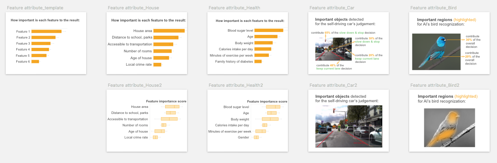
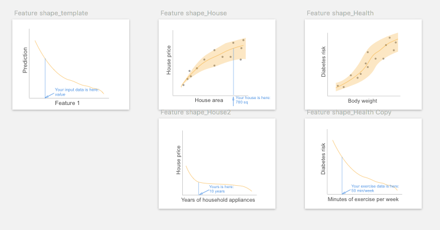

# End-User-Friendly Explanatory Forms

We identify end-user-friendly explanatory forms from technical literature. By end-user-friendly we mean the users are not required to have technical knowledge to understand the explanation.

Index

* [Feature-based explanation](#feature)  
1. [Feature Attribute](#fa)  
2. [Feature Shape](#fs)  
3. [Feature Interaction](#fi)  

 * [Example-based explanation](#example)  
4. [Similar Example](#se)  
5. [Typical Example](#te)  
6. [Counterfactual Example](#ce)  

* [Rule-based explanation](#rule)  
7. [Rule](#rl)  
8. [Decision Tree](#dt)  

* [Supplementary information](#suppl)  
9. [Input](#input)  
10. [Output](#output)  
11. [Performance](#perf)  
12. [Dataset](#data)  

# 1. Feature-based explanation

Feature-based explanations are the most common form of explanation information. 

We refer _feature_ to a piece of information that is carried out by the input data. For example, a real estate agent can describe a house by its size, location, and age, three descriptive features; The feature of an image can be the individual pixels, a car object highlighted, or an explicit concept of "car". 

To use features for explanations, the feature representation must be human-interpretable. 

The feature-based explanations consist of three explanatory forms:

##  1.1 Feature attribute

It indicates which features are important for the decision, and what are their attributions to the prediction. For example, it can be a list of key features and their importance scores to the house price prediction, or a color map overlaid on input image indicating the important parts/objects for the recognition. It assumes the prediction is explainable by linearly addable important features.

### Visual representation

Its visual representation largely depend on the data type of the features. For image and text data, overlaying a **saliency map** or color map on the input is the common visualization. It uses sequential colors to code the fine-grained feature importance score for individual feature (could be pixels for an image input, words for text data). For image/video input data, other popular visualizations include using _masks_, _segmentation maps_ or _bounding boxes_ on the saliency objects.

To visualize multiple feature attributes for tabular or text data, a **bar chart** is typical choice. The variations of bar plot include waterfall plot, treemap, wrapped bars, packed bars, piled bars, Zvinca plots, and tornado plot. _Box plot_ can be used to visualize the distribution of the feature importance score. Its variations include violin plot and beeswarm plot that show more detailed data distribution and skewness.

##  1.2 Feature shape

It shows the relationship between one particular feature and the outcome, such as the house size to the predicted house price. Usually, it is presented as a line plot (for continuous feature) or a bar plot (for categorical feature), depicting whether the relationship between the outcome and a feature is monotonic, linear, or more complex.

### Visual representation
**Line plot** and _scatter plot_ are common visualizations to show the effect of an individual feature to the predicted outcome.

## 1.3 Feature interaction

When features interact with each other, their total effect on the outcome may not be a linear sum of each individual effect. \[Fi\]{style="color: orange"} considers such interaction and shows the total effect of two or three features to the outcome. It can be regarded as an extension of \[fs\]{style="color: orange"} by taking two or more features into account.

### Visual representation
**2D or 3D heatmap** is used to visualize the effect of feature interactions on the predictions. Limited by the visualization, the heatmap can only show interaction for at most three features (using 3D heatmap). More complicated multiple paired feature-feature interactions can be visualized using matrix heatmap, node-link network, or contingency wheel.

## Example-based explanation
### Similar example
### Typical example
### Counterfactual example

## Rule-based explanation
### Rule text
8. Decision tree

## Supplementary information
9. Input
10. Output
11. Performance
12. Dataset

# RQ1: Proprieties of the end-user-friendly explanatory forms {#rq22}

We present the primary findings from the user study, by detailing the
fine-grained proprieties of the 12 explanatory forms (pros, cons,
applicable explanation needs, and design implications).

[**Feature Attribute**]{style="color: orange"}
----------------------------------------------

### **Pros**

In the study, we used a bar chart to represent feature importance score
for tabular data, and color map and bounding box object detection for
image data (Fig. [\[fig:teaser\]](#fig:teaser){reference-type="ref"
reference="fig:teaser"}). All participants **intuitively understood
[feature attribute]{style="color: orange"}**, and over half selected it
(143/248) and ranked it at top positions.

*"[Feature attribute]{style="color: orange"} uses a simple way to
highlight the most important parts, and you can see very clearly at your
first sight how this can be recognized."* (P04, Bird,
[Learning]{style="color: blue"})

*"It's easy to read. \...And you have a bar (chart) here it's really
clear information that people understand instantly."* (P28, House,
[Trust]{style="color: blue"})

By showing *"finer details"* (P10) and *"breakdown and weights of
features"*(P23) *"that AI took into account"* (P31), participants
perceived [feature attribute]{style="color: orange"} **can answer
*"how"* and *"why"* questions**.

*"tells me why"*(P20), *"gives me the behind the scenes"* (P24), *"tells
me how AI read things and how it makes decisions"* (P03), *"have an
understanding of how much weight AI is giving to each of the factors"*
(P22), and *"identify key aspect, \...support its reasoning"* (P18).

### **Applicable Explanation Needs**

By checking feature importance ranking, participants would instantly
*"compare with my own judgment, to see if that aligns with my feature
attribute"* (P01, Car, [Safety]{style="color: blue"}), especially when
participants need to **verify AI's decision**.

### **Cons**

Although a causal relationship may not be confirmed, some participants
tended to **assume [feature attribute]{style="color: orange"} is
causal**, or simplify the relationship among features by assuming they
are **independent from each other**. This was usually occurred when they
were seeking explanation to [improve the predicted
outcome]{style="color: blue"}. And participants were likely to be
informed by the feature importance score to prioritize the most
important features to take actions upon.

*"Seeing that body weight is more important than exercise, I think I
will focus on changing what I ate, instead of like responding by going
to the gym everyday."* (P16, Health, [Improvement]{style="color: blue"})
-- Relies on [feature attribute]{style="color: orange"} to improve the
outcome.

*"It ([feature attribute]{style="color: orange"}) shows what are the
most important factors that AI has taken into account, so you could
target the biggest factors."* (P31, Health,
[Improvement]{style="color: blue"}) -- Assumes a causal relationship and
prioritizes the action.

*"If my blood sugar puts me at a super high risk here, but my caloric
intake doesn't actually put me at that higher risk, it's like a lower
risk, then I would rather just focus on blood sugar. "* (P22, Health
task) -- Ignores the complex interaction between blood sugar and caloric
intake.

### **Design Implications** 

To avoid the above causal illusion, UI/UX design may need to **alarm
users** either implicitly or explicitly that changing the important
features may not necessarily lead to the outcome change in the real
world, due to correlation does not necessarily imply causality.

For designing UI/UX of its prototyping card, designers may consider
**varying different representations** of the feature importance, such as
showing the feature ranking only and allowing users to check the
detailed attribute scores on demand, or allowing users to set a
threshold on the attribute score and only showing features above the
cut-off value, as suggested by a few participants.

*"If the percentage (of the feature) is below the cutoff value, the
users does not need to see (the feature), reduce the cognitive load."*
(P04, Bird, [Learning]{style="color: blue"})

[**Feature Shape**]{style="color: orange"} {#fs}
------------------------------------------

### **Pros**

Participants **liked its graphical representation** of showing the
relationship between one feature and prediction.

*"It ([feature shape]{style="color: orange"} on exercise and diabetes
risk) feels so easy to latch onto like it's something that you can
impact and something that's very tangible."* (P22, Health,
[Trust]{style="color: blue"})

### **Applicable Explanation Needs**

The slope of the curve in [feature shape]{style="color: orange"} line
chart allows users to easily check how changing one feature would lead
to the change of the outcome, thus many participants intuitively used
[feature shape]{style="color: orange"} for **counterfactual reasoning**,
especially to [improve the predicted outcome]{style="color: blue"}.

*"I would be interested to see how much like here ([feature
shape]{style="color: orange"}) increasing the exercise by a small amount
actually makes a really big difference. So that's also helpful to decide
what you should be focusing on to try to avoid it (diabetes). The shape
of the curve actually helps. Coz if I was out here \[pointing to the
flat part of the curve\], then it would not be as helpful for me to
increase my exercise."* (P16, Health,
[Improvement]{style="color: blue"})

By showing the relationship between the protected feature and outcomes,
it also helps to reveal [bias]{style="color: blue"}, i.e.: to check if
the different values of the protected features (such as male, female)
will lead to differences in prediction (such as loan approval).

*"If these features are related to diabetes, then it (AI) should present
some ([feature shape]{style="color: orange"}) cards to tell me if the
gender, age and ethnicity (will affect diabetes prediction), so this
image ([feature shape]{style="color: orange"}) would be really
helpful."* (P02, Health, [Bias]{style="color: blue"})

### **Cons**

One drawback of [feature shape]{style="color: orange"} pointed out by a
few participants is that it does **not considerate feature
interactions**.

*"This one ([feature shape]{style="color: orange"} on house size and
price) is not based on the bigger the house, the higher you can sell,
because it is based on a lot of features. Let's say the house is 2000
square feet. It was built in 1980. Another one is 1000 square feet, but
it's just built a decade ago. So its (the latter) price will be much
higher than this one (the former). You cannot just base on a house area
and then determine the price."* (P30)

Another drawback is that since one [feature
shape]{style="color: orange"} graph can only present one feature, to
show multiple features' [feature shape]{style="color: orange"} the
interface will need multiple graphs that may --

*"make your page so **overloaded**, so people just get tired. You want
to make it as clear as possible. So if (there is) some unnecessary
information people just intimidated."* (P28)

### **Design Implications** 

One suggestion for the above weaknesses is that [feature
shape]{style="color: orange"} can be accompanied by other explanatory
forms and **show on-demand**. Users can select their interested features
from a feature list or other explanatory forms such as [feature
attribute]{style="color: orange"}, [counterfactual
example]{style="color: orange"} or [rule]{style="color: orange"}, and
choose to view [feature shape]{style="color: orange"} diagrams of the
selected features, as participants suggested:

*"If I can click on this ([feature attribute]{style="color: orange"})
and then I can get this chart ([feature shape]{style="color: orange"}),
I think that would be good. I don't think everyone is going to click it,
but I think (if) people want more information, you will click it."*
(P20, House)

Many participants tended to check the **local position of their input
data point** on the global [feature shape]{style="color: orange"}
diagram.

*"It's good to see where exactly on a (house price) scale you are."*
(P20, House, [Trust]{style="color: blue"})

And P30 suggested [feature shape]{style="color: orange"} could have the
assumption that for all the other features that are kept constant, they
should be as similar to user's input features as possible.

*"The AI should assume all the other features are almost the same as
mine, considering this hypothesis then this is the ([feature
shape]{style="color: orange"}) curve"*.

[**Feature Interaction**]{style="color: orange"} {#fi}
------------------------------------------------

### **Applicable Explanation Needs**

Since [feature interaction]{style="color: orange"} just adds one more
feature to the (feature-outcome) diagram to show feature-feature
interactions, it can be regarded as an expanded version of [feature
shape]{style="color: orange"}, and many of the above findings on
[feature shape]{style="color: orange"} apply to [feature
interaction]{style="color: orange"} as well. Similar to [feature
shape]{style="color: orange"}, [feature
interaction]{style="color: orange"} also supports **counterfactual
reasoning** by including two or more features instead of one in [feature
shape]{style="color: orange"}.

*"([feature interaction]{style="color: orange"} on age-body weight
interaction) If you put yourself in a hypothetical guessing, you're in
this age and this is your body weight, and you can already tell the
chances (of diabetes) are high."* (P23, Health,
[Trust]{style="color: blue"})

### **Cons**

*"The graph is **less accessible to understand**"* (P22). In our study,
only a few participants could correctly interpret the 2D heatmap of two
feature interactions.

### **Design Implications**

Similar to [feature shape]{style="color: orange"}, participants would
like to **choose their interested feature pairs** to check their
interactions on [feature interaction]{style="color: orange"} diagram.
Since the combination of features is large, the XAI system may be able
to **suggest interesting feature interactions and prioritize** the
feature pairs which have significant interactions.

*"If I click on any two of them (features), show the relationship
between them. If I can choose age and blood sugar level, then probably
there is some correlation between them. If it is statistically
significant, then I would want to know that. If there is no significance
between, for instance, age and body weight, then I don't think it should
tell me that. If the AI can tell me that this combination really is
important for you to look into, then the priority would also make a lot
of sense."* (P23, Health, [Unexpected]{style="color: blue"})

[**Similar Example**]{style="color: orange"} {#se}
--------------------------------------------

In our study, most participants regarded both [similar
example]{style="color: orange"} and [typical
example]{style="color: orange"} as similar examples. Only a few
participants got the idea of [typical example]{style="color: orange"}
that *"you're getting the average"* (P20). Thus in this section, we
state the themes on [similar example]{style="color: orange"} as well as
the common themes of [similar]{style="color: orange"} and [typical
example]{style="color: orange"}.

### **Pros**

Participants **intuitively understood** the concept of [similar
example]{style="color: orange"}. [Similar
example]{style="color: orange"} uses analogical reasoning to facilitate
to the sense-making process.

*"It just intuitively makes sense to me.
\...[similar]{style="color: orange"} and [typical
example]{style="color: orange"} are much easier. I don't have to think
about them before figuring it out."* (P16, Bird,
[Trust]{style="color: blue"})

*"([similar]{style="color: orange"} and [typical
example]{style="color: orange"}) It's similar to how humans make
decisions, like we compare similar images to the original (input) one."*
(P02, Bird, [Trust]{style="color: blue"})

### **Applicable Explanation Needs**

Unlike other explanatory forms that reveal AI's decision-making process
(such as rule-based explanations) , *"even though these
([similar]{style="color: orange"} and [typical
example]{style="color: orange"}) aren't much specific about how it's
actually doing the (decision) process"* (P16), participants' minds
automatically made up such a process by themselves by **comparing
instances**. Such comparison mainly allow users to **verify AI's
decisions** and to calibrate their trust. The common explanation needs
in which [similar example]{style="color: orange"} were selected are:

**1**) To build [trust]{style="color: blue"}, especially from a personal
and emotional level.

*This ([similar example]{style="color: orange"}) made me trust on an
emotional level. Because I'm thinking, 'Oh really? I am only 33 years
old.' Like I probably not going to get diabetes. But then I'm reading
about somebody that does (get diabetes), that sounds a lot like me, it
kind of emotionally makes me feel like, 'Oh geez, maybe it is accurate.'
So this ([performance]{style="color: orange"},
[output]{style="color: orange"}) is like using my brain, and this one
([similar example]{style="color: orange"}) kind of got me in the gut
like, 'Oh, okay. This could actually happen to me. It happened to this
person who sounds a lot like me.' "* (P16, Health,
[Trust]{style="color: blue"}).

**2**) To verify the decision quality of AI.

*"It's like a proof for my final decision."* (P30)

*"Because AI has only 85% accuracy, I want to see similar ones, and what
AI thinks they are. "* (P14, Bird, [Trust]{style="color: blue"})

*"If it doesn't align (with my prediction), then I want to see some
similar houses to remake the judgment."*(P04, House,
[Unexpected]{style="color: blue"}).

**3**) To assess the level of disagreement when AI made an
[unexpected]{style="color: blue"} prediction, and to reveal potential
flaws of AI.

*"If my prediction appears in [similar example]{style="color: orange"},
it allows me to judge whether AI is completely unreliable or just need
some improvement"* (P01, Bird, [Unexpected]{style="color: blue"}).

### **Cons**

Showing examples for comparison may not be applicable when input data is
incomprehensible or **difficult to read and compare**.

*"I think ([similar ]{style="color: orange"} and [typical
example]{style="color: orange"}) it's not important to me. Because I
need to read other people's status, read their records."* (P02, Health,
[Trust]{style="color: blue"})

In addition, participants easily got confused when instances in [similar
example]{style="color: orange"} have **divergent predictions**. This
problem might be solved by [typical example]{style="color: orange"}
which is stated in Section [1.5](#te){reference-type="ref"
reference="te"}.

*"([similar example]{style="color: orange"}) It's not really telling you
if it (the input) is the one (prediction), so it could be this
(prediction) or this or this \[pointing to different predictions on
[similar example]{style="color: orange"} card\]."* (P26, Bird,
[Trust]{style="color: blue"})

*"This one ([similar example]{style="color: orange"}) has too many
choices (predictions), it's too confusing."*(P05, Bird,
[Trust]{style="color: blue"})

### **Design Implications**

As mentioned above, participants had to compare the features in [similar
example]{style="color: orange"} by themselves. It's important for the
XAI system to support such **side-by-side feature-based comparison**
among instances such as [input]{style="color: orange"},
[similar]{style="color: orange"}, [typical]{style="color: orange"}, or
[counterfactual example]{style="color: orange"}, especially when the
input data format is difficult to read through.

*"I don't want to read the text (in [similar]{style="color: orange"} and
[typical example]{style="color: orange"}), it is better to show those
features and examples in a table for me to compare directly, also
highlight the important features as an analysis process."* (P29, Health,
[Trust]{style="color: blue"})

*" Maybe it could help the doctor to pinpoint things that are similar or
different between these cases."*(P31, Health,
[Communication]{style="color: blue"})

*"I would like a comparison. That's my own house
([input]{style="color: orange"}), which probably will be off the top
somewhere. And I'm comparing it with other information ([typical
example]{style="color: orange"} and [counterfactual
example]{style="color: orange"}). So in a column, and I can compare it.
For the layout, maybe you can do a product comparison."* (P03, House,
[Expected]{style="color: blue"})

[**Typical Example**]{style="color: orange"} {#te}
--------------------------------------------

### **Pros**

One drawback of [similar example]{style="color: orange"} is that it may
make users confused about similar instances. [Typical
example]{style="color: orange"} may solve this problem since the typical
examples for different predictions are more **distinct and separable**
than nearest neighbors of [similar example]{style="color: orange"}.

*"([typical example]{style="color: orange"}) You actually made a
category of each one. I remember in cognitive psychology, there's a
theory. I don't remember the name, but if you clearly separate each
category, that helps people to differentiate the different categories,
then remember. But for this one ([similar
example]{style="color: orange"}), you have to read every one (instance)
of them."* (P04, Bird, [Learning]{style="color: blue"})

### **Applicable Explanation Needs**

Since [typical example]{style="color: orange"} represents the typical
case for the outcome, it may help to reveal class-specific
characteristics or even potential problems in the AI model or data, for
example to **[reveal bias]{style="color: blue"}**.

*"If I'm concerned about what group the data is coming from, I would
love if the typical case like the average that comes up says like, male,
this age, and the factors were quite different from mine, then I kinda
go, 'huh?' But if it could give me a typical case that's actually quite
similar to me, then I would be less worried about it not performing well
with my group."* (P22, Health, [Bias]{style="color: blue"})

Unfortunately, most participants did not realize the meaning of [typical
example]{style="color: orange"} and did not make use of such
"debugging'' property.

### **Design Implications**

In addition to show [typical example]{style="color: orange"} of
different predictions (between-class variation), in some cases, it might
be beneficial to show **different variations of [typical
example]{style="color: orange"}** for a particular prediction
(within-class variation).

*"It's showing different pictures of the same bird, and the colors even
look different. So it's saying maybe, 'Oh, I get it, we have the male
and female.' So it's showing different looks that the bird can have.''*
(P06, Bird, [Learning]{style="color: blue"})

Opposite to [typical example]{style="color: orange"}, some participants
expected to see non-typical or edge cases that represent rare but severe
consequences, mainly due to safety and bias concerns.

*"So they ([similar]{style="color: orange"} and [typical
example]{style="color: orange"}) don't really provide enough information
about when the weather is different and when you're driving at night,
the results from non-typical conditions."* (P27, Car,
[Bias]{style="color: blue"})

*"I still don't know if the dog jumps out of nowhere. so maybe the
([similar example]{style="color: orange"}) similar traffic conditions
can see the extreme cases."* (P03, Car, [Safety]{style="color: blue"})

[**Counterfactual Example**]{style="color: orange"}
---------------------------------------------------

### **Pros and Applicable Explanation Needs**

In our study, [counterfactual example]{style="color: orange"} was shown
as two instances of different predictions, with their feature
differences highlighted while keeping other features the same (Figure
 [\[fig:teaser\]](#fig:teaser){reference-type="ref"
reference="fig:teaser"}). This format can serve for different
explanation needs depending on the task context. In predictive tasks
(House and Health), participants regarded [counterfactual
example]{style="color: orange"} as the most direct explanatory form to
**suggest an [improvement]{style="color: blue"}**.

*"For renovations, I think that's ([counterfactual
example]{style="color: orange"}) the only card I would choose. The only
one that really tells me that I can do something to increase the
price."* (P20, House, [Improvement]{style="color: blue"})

While in recognition task (Bird), [counterfactual
example]{style="color: orange"} is suitable to **show the differences**
to [differentiate]{style="color: blue"} two similar predictions.

*"[Counterfactual example]{style="color: orange"} let me learn their
relationship, highlight the difference between the two (birds). Help me
remember the different features."* (P11, Bird,
[Learning]{style="color: blue"})

### **Cons**

Some participants did not understand the meaning of [counterfactual
example]{style="color: orange"}, and could not capture the nuance
between [feature attribute]{style="color: orange"} and [counterfactual
example]{style="color: orange"}, since they both have features
highlighted but for different reasons ([feature
attribute]{style="color: orange"} highlights important features for
prediction, whereas [counterfactual example]{style="color: orange"}
highlights what features need to change for the alternative outcome to
happen).

[Counterfactual example]{style="color: orange"} may have the risk to
make participants **confused about similar instances**, especially in
recognition tasks.

*"I think this tool ([counterfactual example]{style="color: orange"})
will make me remember the wrong thing. I'm already confused. It shows
information that is similar."* (P11, Bird)

Thus it may not be the beginning explanations and may only show up
on-demand, for example, for the two explanation needs of
[improvement]{style="color: blue"} and
[differentiation]{style="color: blue"} mentioned above.

### **Design Implications**

The two **contrastive outcomes in [counterfactual
example]{style="color: orange"} can be user-defined or pre-generated**
depending on the specific explanation needs. One outcome is usually from
user's current instance such as input, and the alternative outcome can
be: *"the next possible prediction"* (P18, Bird,
[Report]{style="color: blue"}), users' own prediction when there's a
disagreement ([Unexpected]{style="color: blue"}), the prospective
outcome for [improvement]{style="color: blue"}, and the easily confused
outcome for [differentiation]{style="color: blue"}.

The generating of counterfactual features may also receive user-defined
or pre-defined constraints, such as: **1**) constraints on the
counterfactual feature type to include **controllable features only**
(see Section [2.8](#control){reference-type="ref" reference="control"}
[Improvement]{style="color: blue"} on controllable features); **2**)
generate **personalized counterfactual suggestions** based on features
that users look upon: *"the recommendation should be a lot based on what
I do"* (P24, Health); and **3**) constraints on the range of specific
counterfactual features: *"AI should accept my personalized constraints
on budget* (P01, House, [Improvement]{style="color: blue"}). Given these
constraints, the XAI system can also provide multiple improvement
suggestions for users to choose from (P01, P11), and may give weights or
relative ranking on multiple suggestions.

[**Decision Rule**]{style="color: orange"}
------------------------------------------

Many participants noticed the three formats of rule-based explanations
([rule]{style="color: orange"}, [decision tree]{style="color: orange"})
provided *"basically the same information"* (P02, Health), *"all show
the decision process"* (P10, Bird), and were only different in the text
([rule]{style="color: orange"}) or graphical ([decision
tree]{style="color: orange"}) representation.

### **Pros**

Several participants regarded [rule]{style="color: orange"} can
*"**explain the logic** behind how the AI makes decisions"* (P27).
Particularly, the text description format is *"like human explanation"*
(P01, House, [Trust]{style="color: blue"}), and *"simple enough and
understandable"* (P11).

### **Applicable Explanation Needs**

The above pros make it suitable for verbal
(Section [2.9](#communicate){reference-type="ref"
reference="communicate"} [Communication]{style="color: blue"}) and
written **communications** (Section [2.10](#report){reference-type="ref"
reference="report"} [Report]{style="color: blue"}). Text format may also
help to dispel confusion, since some participant regarded texts as being
more precise than images, thus **facilitate
[learning]{style="color: blue"}**.

*"In this case (Bird, [Unexpected]{style="color: blue"}), I don't want
to see the highlights ([feature attribute]{style="color: orange"}). I
want it to see points, the specific parts and give me some explanation.
If I'm trying to prove myself wrong, or if I want to see how AI system
can prove me wrong, I want to see more precise text, and precisely point
out the important information."* (P04)

*"The written helps because it's more exact, whereas the pictures,
\...the blue in the picture might not be the blue that was in the
written."* (P05, Bird, [Learning]{style="color: blue"})

*"([rule]{style="color: orange"}) It's listing out something that a
person might miss in the picture."* (P18, Bird)

However, when the input is image data, some participants also mentioned
providing text explanations only was not enough.

*"([rule]{style="color: orange"}) It doesn't really show you the bird
that you were looking at. Lots of birds have small thin bills short
tails\...if I can't see a picture of it, then it's not as helpful."*
(P06, Bird, [Trust]{style="color: blue"})

And many participants suggested *"ideally you'd want both written and
pictures"* (P05) to complement each other.

### **Cons**

[rule]{style="color: orange"} is **very sensitive to the degree of
complexity** in text descriptions, as an increase in rule length or
number of features will dramatically reduce its simplicity and the above
advantages [@Narayanan2018]. However, if the rule clauses are short, the
explanation may not be precise and satisfying as well, as P06 pointed
out,

*"It ([rule]{style="color: orange"}) is just too broad, it could apply
to so many other birds."*

Another concern is that since participants lack technical knowledge,
some of them misinterpreted [rule]{style="color: orange"} as
instructions human fed to the AI.

*"([rule]{style="color: orange"}) it is giving very clear instructions
to the AI, like written text instructions, these are already fed into
the system."* (P09, Car, [Safety]{style="color: blue"})

### **Design Implications**

To reduce the cognitive load of complex [rule]{style="color: orange"}, a
few participants suggested **trimming the rules** by only showing the
shallow level, or only showing rules containing the current input *"just
show [rule]{style="color: orange"} related to my own house features"*
(P30), then users may query details on demand.

To carefully balance between explanation completeness and usability, if
the full [rule]{style="color: orange"} is shown, it's beneficial to
**highlight *local* rule clauses** describing the current instance on
top of the *global* [rule]{style="color: orange"} explanation.

[**Decision Tree**]{style="color: orange"}
------------------------------------------

### **Pros**

Similar to [rule]{style="color: orange"}, participants regarded
[decision tree]{style="color: orange"} as *"the most logical one"* (P20)
that *"**tells you the decision-making process**"* (P04):

*"([decision tree]{style="color: orange"}) shows the process of thinking
with AI, what it's going to do with the information."* (P10)

*"how the algorithm is working, what the machine is thinking about when
it's coming up with the prediction."* (P16)

### **Applicable Explanation Needs**

Participants mentioned an advantage of [decision
tree]{style="color: orange"} is to
**[differentiate]{style="color: blue"}**, possibly due to its unique
tree layout:

*"It explained very well what's the difference between them (the two
confusing instances)."*(P04, Bird, [Report]{style="color: blue"})

*"It would show you how to pick up the different types of variants."*
(P10, Bird, [Report]{style="color: blue"})

*"I think this ([decision tree]{style="color: orange"}) is the graphic
comparison, like this beak might be sharper or smaller than this one,
all those comparisons help"* (P09, Bird,
[Unexpected]{style="color: blue"}).

Such advantage also supports **counterfactual reasoning** by checking
alternative feature values on the adjacent branches.

*"([Decision tree]{style="color: orange"}) can see how to improve. It
has a comparison with different outputs."* (P29, Health,
[Trust]{style="color: blue"})

*"Where does my house stands, if I'd be here, then I maybe try to change
some of my features, to see how do these features affect my house price,
or other houses compared to my own house."* (P30, House)

### **Cons**

Several participants brought up its **weakness in communication and
interpretation**.

*"([Decision tree]{style="color: orange"}) is not natural language, it
is more difficult to explain to my family."* (P01, House,
[Communication]{style="color: blue"})

*"This is more like a logical thing for me to see. But I wouldn't use
this as an explanation to family, because that's just weird. I don't
want to rack their brains too much."* (P20, House,
[Communication]{style="color: blue"})

Indeed, in the study even with a two-feature two-layer [decision
tree]{style="color: orange"}, a number of participants commented:

*"It's confusing."* (P05, Bird, [Learning]{style="color: blue"})

*"It got too much information."* (P16, Bird,
[Unexpected]{style="color: blue"})

*"I don't really understand this one. I think it's a little bit
complicated."* (P08, Bird, [Learning]{style="color: blue"})

Since it is less interpretable than other forms, some participants
suggested to show it on-demand.

*"I don't think these two ([decision tree]{style="color: orange"},
[decision flow chart]{style="color: orange"}) are necessary to show in
the first UI. Maybe these two can be hidden in an icon that says
'process'. Because it ([decision tree]{style="color: orange"}) is more
like a program in process.''* (P04, Bird, [Trust]{style="color: blue"})

Besides the tree structure, we used another flow chart visual
representation ([decision flow chart]{style="color: orange"}) in the
study. In tasks that the inputs were images (Bird and Car task), quite a
few participants found neither the tree nor the flow chart structure
helpful, and they only focused on the saliency features or objects the
flow chart shows.

*"I don't think it (the flow chart structure) matters, just the head and
the belly (the highlighted region shown in the flow chart) matter."*
(P14, Bird)

### **Design Implications**

Similar to the suggestions in [rule]{style="color: orange"}, to reduce
its complexity, one participant suggested **trimming the tree** and just
show the main branches, hiding the deeper branch details and only
showing them on-demand.

*"You could use this one (the two-feature [decision
tree]{style="color: orange"}) as a beginning, based on this, and you
click (one branch) to another in-depth version of the price calculation.
Because this (price prediction) range is still very far wide, and the
features given is not enough, so if you want to (check details) maybe
click and (it will) add more features to it (that branch), then get a
narrow range (of prediction)."* (P28, House)

Although rule-based explanations are *global* explanations, many
participants tended to seek the branch pathway where their own input
resides. It served as a *local* explanation on top of the *global*
explanation. It suggested an XAI system may only show the branches
containing interested instances, or **highlight branches for their
interested instances**. They did so for the needs to verify AI's
decisions, and for comparison with other counterfactual instances.

*"I know there're factors that could be other houses that lead to
different prices, but I still see it as, 'okay, I plug in my own numbers
here and what's my price?' So it's still specific to me.'* (P20, House,
[Trust]{style="color: blue"}) -- Displays local as well as global
explanations

*"The only thing we need is to indicate my own position on this
([decision tree]{style="color: orange"}) branch. \....Then I can chase
the features of my house."* (P30, House,
[Unexpected]{style="color: blue"}) -- Suggests to highlight the pathway
for user's interested instance

![ **Visualizing the similarities of the explanatory forms**. The
explanatory forms that are close to each other indicate they are more
likely to be selected together to construct an explanation. The total
number of times an explanatory type was selected is indicated as the
number below its name, also proportional to its dot size. The dot color
indicates one of the four categories in the framework the explanatory
type belongs to: [feature]{style="color: lightorange"},
[example]{style="color: example"}, [rule]{style="color: rule"}, and
[supplementary information]{style="color: blue"}. K-means clustering
analysis on the 2D positional data yielded four clusters: **Cluster 1**:
output, performance, dataset; **Cluster 2**: feature attribute, decision
tree, rule, decision flow chart; **Cluster 3**: typical example, similar
example, counterfactual example, input; **Cluster 4**: feature shape,
feature interaction. ](figures/sim_2021.pdf){width="70%"}

\Description{}
[\[fig:sim\]]{#fig:sim label="fig:sim"}

[**Input**]{style="color: orange"}
----------------------------------

It serves as necessary background information, and participants regarded
[input]{style="color: orange"} as a *"profile"* (P24) that *"stating the
facts"* (P20). It allows participants to **understand what information
AI's decision is based on**, and can help "debug'' to see *"if AI is
missing the most important feature"* in [input]{style="color: orange"}
(P22, Health, [Bias]{style="color: blue"}), and *"whether or not the
[input]{style="color: orange"} is enough for it (AI) to make that
decision"* (P16, Health, [Trust]{style="color: blue"}).

When checking [input]{style="color: orange"}, participants tended to
intuitively *"look for certain features"* (P14) to judge by themselves.
And in the card sorting, some participants used
[input]{style="color: orange"} as an anchor, put it side-by-side with
example-bases explanatory forms ([similar]{style="color: orange"},
[typical]{style="color: orange"}, and [counterfactual
example]{style="color: orange"}) for comparison. Quantitative results
led to the same findings, as [input]{style="color: orange"} was
clustered together with other example-based explanatory forms
(Figure [\[fig:sim\]](#fig:sim){reference-type="ref"
reference="fig:sim"}, Supplementary Material S2 Figure ??).

[**Output**]{style="color: orange"}
-----------------------------------

In our study, the [output]{style="color: orange"} card contained
prediction information of a point prediction, a prediction range, and
their corresponding uncertainty level (for regression tasks); Or top
three predictions and their likelihood (for classification tasks)
(Fig [\[fig:teaser\]](#fig:teaser){reference-type="ref"
reference="fig:teaser"}). For the output information presentation, some
participants preferred to check the point prediction at the beginning,
and check the detailed prediction range and uncertainty level on-demand
or leave them at the end, since they *"need a longer time to understand
what these numbers mean"* (P02).

Participants had divergent preferences and understandings on the
prediction presentation form. Compared to a point prediction (e.g.:
house price prediction is 650k), some preferred to see a **prediction
range** in regression tasks (e.g.: house price is 638-662k), or top
predictions list in classification tasks, because such prediction range
*"give choices"* (P05, Bird classification task,
[Differentiation]{style="color: blue"}), *"acknowledges a possibility"*
(P18, Bird, [Unexpected]{style="color: blue"}), rank the decision
priorities (P03, Car classification task,
[Safety]{style="color: blue"}), help them *"(the range) to see how
different between my and AI prediction"* (P01, House regression task,
[Unexpected]{style="color: blue"}), and provide rooms for adjustment and
negotiation:

*"If I want to sell it higher, and I'll put 662k (the upper bound). Or
if I wanted to sell it fast, then I'll put 638k (the lower bound).
There's always a range, it's not necessarily just one price. And people
will always bargain too."* (P20, House,
[Communication]{style="color: blue"})

And sometimes they *"don't even need to know the (prediction) number
exactly. This (range) tells me that (my diabetes risk) it's high. I have
to do something. So that's what I want to know"* (P17, Health regression
task, [Trust]{style="color: blue"}), and the range gives a higher
certainty than a single point prediction which enhanced participants'
trust.

In contrast, some other participants were more acceptable to a narrower
range or a **point prediction**, because they saw a wider range of
prediction had its drawbacks: *"(the prediction range) shows too much
fluctuation"* (P07, House, [Trust]{style="color: blue"}); And seeing the
full predictions list (some with lower prediction likelihoods) may make
them confused and discredit AI's decisions. Thus a narrower range may
give them more confidence about AI's prediction.

*"Seeing that the range is pretty small makes me a lot more confident
that they've got enough data to actually be drawing conclusions."* (P16,
Health, regression task, [Trust]{style="color: blue"})

For the prediction likelihood/uncertainty/confidence[^1], some
participants **had a hard time understanding the meaning of
uncertainty** and required researchers' explanations. A high certainty
*"reassure AI's performance"* (P22), *"help a lot of persuading yourself
into believing in AI"* (P10), which is consistent with the recent
quantitative finding on certainty level and trust
calibration [@Zhang2020]. Especially for the explanation need where AI's
prediction is [unexpected]{style="color: blue"}, participants may
abandon their own judgment due to AI's high certainty.

*"If it had a high certainty, then I would want to know why my
estimation is wrong."* (P10, House, [Unexpected]{style="color: blue"})

[**Performance**]{style="color: orange"}
----------------------------------------

After checking the [performance]{style="color: orange"} information,
most participants realized the probabilistic nature of AI decisions:
*"AI is not perfect"* (P20), *"they (AI) make errors sometimes"* (P05).
If the performance is within their acceptable range, participants would
accept the "imperfect AI'', and it helped them to **set a proper
expectation for AI's performance**.

*"I get it's downside. [Performance]{style="color: orange"} warns me to,
'Hey, you know, it's not really accurate. There's some room for error.'
"* (P24)

And sometimes participants may calibrate their trust according to the
error rate (in classification tasks) or error margin (in regression
tasks).

*"If there is a really big margin (of error), then it would probably
demean the trust"* (P23).

Almost all participants understood the meaning of accuracy (error rate)
in classification tasks, whereas many participants had a difficult time
understanding the margin of error in regression tasks.

*"[Performance]{style="color: orange"} is really in detail. I mean not
everyone is familiar with statistics, like mean error"* (P30, House,
regression task).

Unlike the uncertainty level in [output]{style="color: orange"}
(Section [1.10](#output){reference-type="ref" reference="output"}) which
is case-specific decision quality information, a few participants
noticed [performance]{style="color: orange"} is model-wide information,
and just provides *"general information showing the trust level of the
system"* (P04) is *"too general, I would want to know specifically why
(the speed) it's going down in this particular case of driving"* (P05,
Car, [Unexpected]{style="color: blue"}). Thus they suggested there was
no need to show it every time, *"you should know before you use AI"*
(P11).

However, in some particular explanation needs such as to [detect
bias]{style="color: blue"} (Section [2.3](#bias){reference-type="ref"
reference="bias"}), participants may require to check the fine-grained
performance analysis on interested outcome.

*"It (fine-grained [performance]{style="color: orange"} on road/weather
conditions) explains how often I should be confident in rainy days."*
(P19, Car, [Safety]{style="color: blue"})

[**Dataset**]{style="color: orange"}
------------------------------------

In our study, the [dataset]{style="color: orange"} card contains
training dataset distribution of the prediction outcomes. Even after
researchers' explanation, some participants did not well understand or
**misunderstood** the information on this card (for example, some
misinterpret the distribution graph as [feature
shape]{style="color: orange"}), indicating it requires a higher
AI/math/visualization literacy. For those who comprehended the
[dataset]{style="color: orange"} information, some participants tended
to link the dataset size with model accuracy and trust.

*"The higher the (training data distribution) curve goes, then I would
be more confident that they have a big pool of data to pull from."*(P31,
Health, [Unexpected]{style="color: blue"})

Some participants intuitively wanted to check their own data point
within the training data distribution, and use it as a dashboard to
**navigate, identify, and filter interested instances** such as
([similar]{style="color: orange"}, [typical]{style="color: orange"}, and
[counterfactual example]{style="color: orange"}), to compare what are
the same and different features between their input and the interested
instances.

*"I want to see which region I fall in the population, and compare with
people around to see why my (diabetes) risk is only 10% with a family
history."* (P01, Health, [Unexpected]{style="color: blue"})

Nevertheless, in practice there may be some restrictions on reviewing
the detailed [dataset]{style="color: orange"} information due to data
proprietary and privacy, as brought out by P19:

*"I want to know the number of data and the details of it to verify. But
I don't know if that's going to be able to be viewed. That's probably
secret, right?"* (P19, House, [Expected]{style="color: blue"})

# Open-sourced XAI software packages
[Alibi](https://docs.seldon.io/projects/alibi/en/v0.2.0/overview/getting_started.html)

[Software list1](https://github.com/lopusz/awesome-interpretable-machine-learning#software)

[Softwareblist 2](https://github.com/jphall663/awesome-machine-learning-interpretability#explainability--or-fairness-enhancing-software-packages)

[Captum, a pytorch XAI library](https://captum.ai/) 

