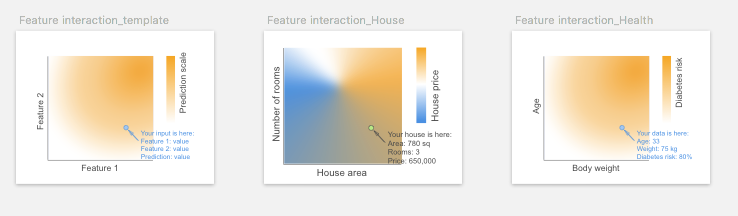
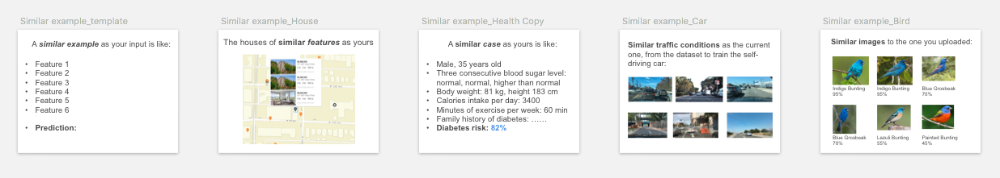
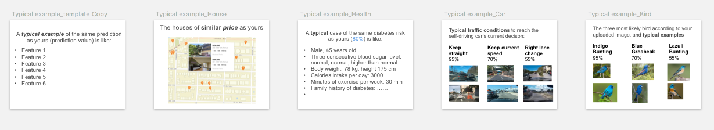
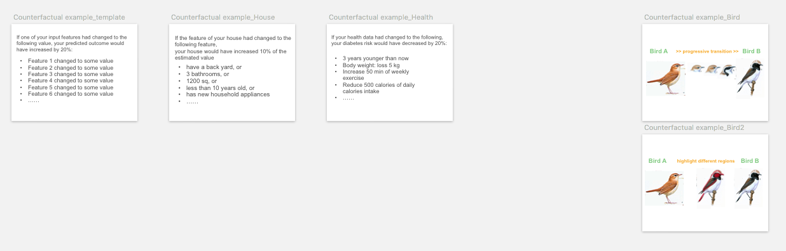
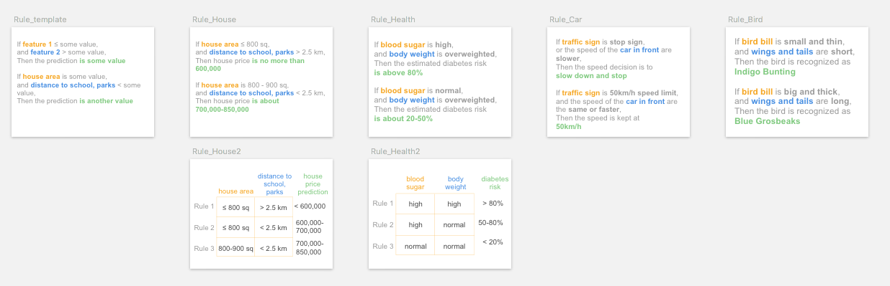
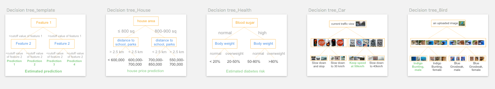
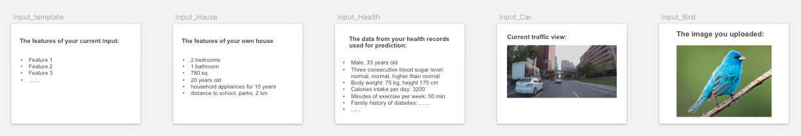
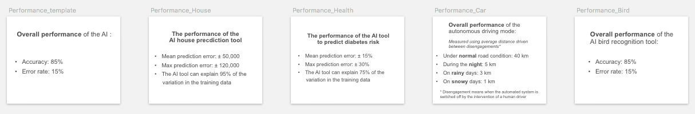
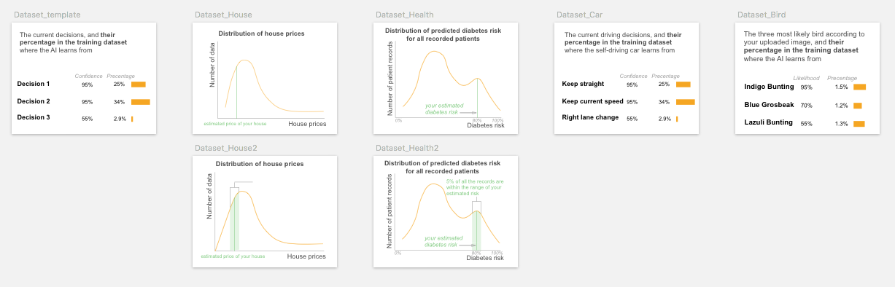

# End-User-Friendly Explanatory Forms

We identify end-user-friendly explanatory forms from technical literature. By end-user-friendly we mean the users are not required to have technical knowledge to understand the explanation.

**Index**

* [Feature-based explanation](#feature)  
1. [Feature Attribute](#fa)  
2. [Feature Shape](#fs)  
3. [Feature Interaction](#fi)  

 * [Example-based explanation](#example)  
4. [Similar Example](#se)  
5. [Typical Example](#te)  
6. [Counterfactual Example](#ce)  

* [Rule-based explanation](#rule)  
7. [Rule](#rl)  
8. [Decision Tree](#dt)  

* [Supplementary information](#suppl)  
9. [Input](#input)  
10. [Output](#output)  
11. [Performance](#perf)  
12. [Dataset](#data)  

—

# 1. Feature-based explanation

Feature-based explanations are the most common form of explanation information. 

We refer _feature_ to a piece of information that is carried out by the input data. For example, a real estate agent can describe a house by its size, location, and age, three descriptive features; The feature of an image can be the individual pixels, a car object highlighted, or an explicit concept of "car". 

To use features for explanations, the feature representation must be human-interpretable. 

The feature-based explanations consist of three explanatory forms:

##  1.1 Feature Attribute

It indicates which features are important for the decision, and what are their attributions to the prediction. For example, it can be a list of key features and their importance scores to the house price prediction, or a color map overlaid on input image indicating the important parts/objects for the recognition. It assumes the prediction is explainable by linearly addable important features.

### Visual representation

Its visual representation largely depend on the data type of the features. For image and text data, overlaying a **saliency map** or color map on the input is the common visualization. It uses sequential colors to code the fine-grained feature importance score for individual feature (could be pixels for an image input, words for text data). For image/video input data, other popular visualizations include using _masks_, _segmentation maps_ or _bounding boxes_ on the saliency objects.

To visualize multiple feature attributes for tabular or text data, a **bar chart** is typical choice. The variations of bar plot include waterfall plot, treemap, wrapped bars, packed bars, piled bars, Zvinca plots, and tornado plot. _Box plot_ can be used to visualize the distribution of the feature importance score. Its variations include violin plot and beeswarm plot that show more detailed data distribution and skewness.

### Pros

Users can **intuitively understood** feature attribute, and would likely accept it as an explanation.

>*" It uses a simple way to highlight the most important parts, and you can see very clearly at your first sight how this can be recognized."* 

> *"It's easy to read. ...And you have a bar (chart) here it's really clear information that people understand instantly."*

By showing *"finer details"* and *"breakdown and weights of features" *"that AI took into account" , participants perceived feature attribute **can answer *"how"* and *"why"* questions**.

> *"tells me why", *"gives me the behind the scenes", *"tells me how AI read things and how it makes decisions", *"have an understanding of how much weight AI is giving to each of the factors", and *"identify key aspect, ...support its reasoning"*.

### **Applicable Explanation Needs**

By checking feature importance ranking, participants would instantly *"compare with my own judgment, to see if that aligns with my feature attribute"*, especially when participants need to **verify AI's decision**.

### **Cons**

Although a causal relationship may not be confirmed, some participants tended to **assume feature attributeis causal**, or simplify the relationship among features by assuming they are **independent from each other**. This was usually occurred when they were seeking explanation to improve the predicted outcome. And participants were likely to be informed by the feature importance score to prioritize the most important features to take actions upon.

> *"Seeing that body weight is more important than exercise, I think I will focus on changing what I ate, instead of like responding by going to the gym everyday."*  -- Relies on feature attributeto improve the outcome.

> *"It (feature attribute) shows what are the most important factors that AI has taken into account, so you could target the biggest factors."*-- Assumes a causal relationship and prioritizes the action.

> *"If my blood sugar puts me at a super high risk here, but my caloric intake doesn't actually put me at that higher risk, it's like a lower risk, then I would rather just focus on blood sugar. "* -- Ignores the complex interaction between blood sugar and caloric intake.

### **Design Implications**

To avoid the above causal illusion, UI/UX design may need to **alarm users** either implicitly or explicitly that changing the important features may not necessarily lead to the outcome change in the real world, due to correlation does not necessarily imply causality.

For designing UI/UX of its prototyping card, designers may consider **varying different representations** of the feature importance, such as showing the feature ranking only and allowing users to check the detailed attribute scores on demand, or allowing users to set a threshold on the attribute score and only showing features above the cut-off value, as suggested by a few participants.

> *"If the percentage (of the feature) is below the cutoff value, the users does not need to see (the feature), reduce the cognitive load."* 

##  1.2 Feature Shape

It shows the relationship between one particular feature and the outcome, such as the house size to the predicted house price. Usually, it is presented as a line plot (for continuous feature) or a bar plot (for categorical feature), depicting whether the relationship between the outcome and a feature is monotonic, linear, or more complex.

### Visual representation

**Line plot** and _scatter plot_ are common visualizations to show the effect of an individual feature to the predicted outcome.

### **Pros**

Participants **liked its graphical representation** of showing the relationship between one feature and prediction.

*"It (\[feature shape\]{style="color: orange"} on exercise and diabetes risk) feels so easy to latch onto like it's something that you can impact and something that's very tangible."* (P22, Health, \[Trust\]{style="color: blue"})

### **Applicable Explanation Needs**

The slope of the curve in \[feature shape\]{style="color: orange"} line chart allows users to easily check how changing one feature would lead to the change of the outcome, thus many participants intuitively used \[feature shape\]{style="color: orange"} for **counterfactual reasoning**, especially to \[improve the predicted outcome\]{style="color: blue"}.

*"I would be interested to see how much like here (\[feature shape\]{style="color: orange"}) increasing the exercise by a small amount actually makes a really big difference. So that's also helpful to decide what you should be focusing on to try to avoid it (diabetes). The shape of the curve actually helps. Coz if I was out here \[pointing to the flat part of the curve\], then it would not be as helpful for me to increase my exercise."* (P16, Health, \[Improvement\]{style="color: blue"})

By showing the relationship between the protected feature and outcomes, it also helps to reveal \[bias\]{style="color: blue"}, i.e.: to check if the different values of the protected features (such as male, female) will lead to differences in prediction (such as loan approval).

*"If these features are related to diabetes, then it (AI) should present some (\[feature shape\]{style="color: orange"}) cards to tell me if the gender, age and ethnicity (will affect diabetes prediction), so this image (\[feature shape\]{style="color: orange"}) would be really helpful."* (P02, Health, \[Bias\]{style="color: blue"})

### **Cons**

One drawback of \[feature shape\]{style="color: orange"} pointed out by a few participants is that it does **not considerate feature interactions**.

*"This one (\[feature shape\]{style="color: orange"} on house size and price) is not based on the bigger the house, the higher you can sell, because it is based on a lot of features. Let's say the house is 2000 square feet. It was built in 1980. Another one is 1000 square feet, but it's just built a decade ago. So its (the latter) price will be much higher than this one (the former). You cannot just base on a house area and then determine the price."* (P30)

Another drawback is that since one \[feature shape\]{style="color: orange"} graph can only present one feature, to show multiple features' \[feature shape\]{style="color: orange"} the interface will need multiple graphs that may --

*"make your page so **overloaded**, so people just get tired. You want to make it as clear as possible. So if (there is) some unnecessary information people just intimidated."* (P28)

### **Design Implications**

One suggestion for the above weaknesses is that \[feature shape\]{style="color: orange"} can be accompanied by other explanatory forms and **show on-demand**. Users can select their interested features from a feature list or other explanatory forms such as \[feature attribute\]{style="color: orange"}, \[counterfactual example\]{style="color: orange"} or \[rule\]{style="color: orange"}, and choose to view \[feature shape\]{style="color: orange"} diagrams of the selected features, as participants suggested:

*"If I can click on this (\[feature attribute\]{style="color: orange"}) and then I can get this chart (\[feature shape\]{style="color: orange"}), I think that would be good. I don't think everyone is going to click it, but I think (if) people want more information, you will click it."* (P20, House)

Many participants tended to check the **local position of their input data point** on the global \[feature shape\]{style="color: orange"} diagram.

*"It's good to see where exactly on a (house price) scale you are."* (P20, House, \[Trust\]{style="color: blue"})

And P30 suggested \[feature shape\]{style="color: orange"} could have the assumption that for all the other features that are kept constant, they should be as similar to user's input features as possible.

*"The AI should assume all the other features are almost the same as mine, considering this hypothesis then this is the (\[feature shape\]{style="color: orange"}) curve"*.

## 1.3 Feature Interaction

When features interact with each other, their total effect on the outcome may not be a linear sum of each individual effect. Ficonsiders such interaction and shows the total effect of two or three features to the outcome. It can be regarded as an extension of fsby taking two or more features into account.

### Visual representation

**2D or 3D heatmap** is used to visualize the effect of feature interactions on the predictions. Limited by the visualization, the heatmap can only show interaction for at most three features (using 3D heatmap). More complicated multiple paired feature-feature interactions can be visualized using matrix heatmap, node-link network, or contingency wheel.

### **Applicable Explanation Needs**

Since \[feature interaction\]{style="color: orange"} just adds one more feature to the (feature-outcome) diagram to show feature-feature interactions, it can be regarded as an expanded version of \[feature shape\]{style="color: orange"}, and many of the above findings on \[feature shape\]{style="color: orange"} apply to \[feature interaction\]{style="color: orange"} as well. Similar to \[feature shape\]{style="color: orange"}, \[feature interaction\]{style="color: orange"} also supports **counterfactual reasoning** by including two or more features instead of one in \[feature shape\]{style="color: orange"}.

*"(\[feature interaction\]{style="color: orange"} on age-body weight interaction) If you put yourself in a hypothetical guessing, you're in this age and this is your body weight, and you can already tell the chances (of diabetes) are high."* (P23, Health, \[Trust\]{style="color: blue"})

### **Cons**

*"The graph is **less accessible to understand**"\* (P22). In our study, only a few participants could correctly interpret the 2D heatmap of two feature interactions.

### **Design Implications**

Similar to \[feature shape\]{style="color: orange"}, participants would like to **choose their interested feature pairs** to check their interactions on \[feature interaction\]{style="color: orange"} diagram. Since the combination of features is large, the XAI system may be able to **suggest interesting feature interactions and prioritize** the feature pairs which have significant interactions.

*"If I click on any two of them (features), show the relationship between them. If I can choose age and blood sugar level, then probably there is some correlation between them. If it is statistically significant, then I would want to know that. If there is no significance between, for instance, age and body weight, then I don't think it should tell me that. If the AI can tell me that this combination really is important for you to look into, then the priority would also make a lot of sense."* (P23, Health, \[Unexpected\]{style="color: blue"})

—

# 2. Example-based explanation

Human uses examples to learn and explain. Examples carry contextual information and are intuitive for end-users to interpret. Three different types of examples are included:

## 2.1 Similar example

Similar examples are instances that are similar to the input data regarding their features in the feature space.

##  2.2 Typical example

A typical or prototypical example is a representative instance for a certain prediction. For example, a typical example of the diabetes prediction could be a patient who exhibits the typical features (abnormal hemoglobin A1C level) used by clinicians to diagnose diabetes.

### Visual representation 

For similar and typical examples, it is straightforward to show several the examples with their corresponding predictions.

## 2.3 Counterfactual example

Its features are similar to the input, but has minimal feature changes so that its prediction is distinct from the input. 

For example, an instance C that is predicted as healthy is a counterfactual example for the input I that is predicted to have diabetes, if C has all the same features as I, except its blood sugar level is lower than I. 

### Visual representation 

Counterfactual examples can be shown as two instances with their **counterfactual/contrastive features highlighted**, or a **transition** from one instance to the other by gradually changing the counterfactual features.

—

#  3. Rule-based explanation
Rule-based explanations are explanations where decisions of the model, in whole or in part, can be described succinctly by a set of logical if/else statements, mimicking human reasoning and decision making. It also implies the decision boundary thus may be convenient for counterfactual reasoning. The rule-based explanation is a global explanation of the model's overall behavior. It includes the following explanatory forms. We note rule and decision tree actually carry out similar explanation information. But since they are usually generated by different XAI algorithms, and their representation format (text vs. diagram) are distinct to the end-users, we separate the two explanatory forms.

## 3.1 Rule text

The decision rules or decision sets are simple IF-THEN statement with condition and prediction. For example: IF blood sugar is high, AND body weight is over-weighted, THEN the estimated diabetes risk is over 80%.

### Visual representation

Rules are usually represented using **text**. Other representing formats include table @Castro2019\] or matrix @Ming2019\] to easily align and compare rule clauses.

##  3.2 Decision tree

Rule is represented graphically as a tree structure, with the branch representing the decision pathway, and the leaf is the outcome.

### Visual representation

The most common representation is to use a node-link **tree diagram**. other visual representations to show the hierarchical structure include treemap, cladogram, hyperbolic tree, dendrogram, and flow chart.

—

#  4. Supplementary information

In addition to the above explanatory forms generated by XAI algorithms, an XAI system needs to present some necessary supplementary information to the end-users, such as input, output, decision confidence/certainty, model performance metrics, training dataset information such as data distribution, etc. We included the following essential and common ones in our framework, and indicates whether they are global (explaining the model's overall behavior) or local explanation (explaining the decision to the individual instance):

##  4.1 Input

Input is end-users' input data for AI's prediction. It is local explanation.

##  4.2 Output

Output is AI's prediction on the input. It is local explanation.

Sometimes the output prediction is accompanied by **decision certainty** level. Since the prediction from AI models is usually probabilistic, the certainty score shows the case-specific certainty level about how confident model is in making this particular decision. The certainty is local information on the particular prediction.

##  4.3 Performance

Performance metrics (such as accuracy, confusion matrix, ROC curve, mean squared error) help end-users to judge the overall decision quality of the model, and to set a proper expectation on the model's capability. It is global information about the overall performance of the model. 

##  4.4 Dataset

Dataset information includes the metadata on the dataset where the model is trained on, such as data distribution, may help end-users to understand the model and identify potential flaws in the data.

# Open-sourced XAI software packages
[Alibi](https://docs.seldon.io/projects/alibi/en/v0.2.0/overview/getting_started.html)

[Software list1](https://github.com/lopusz/awesome-interpretable-machine-learning#software)

[Softwareblist 2](https://github.com/jphall663/awesome-machine-learning-interpretability#explainability--or-fairness-enhancing-software-packages)

[Captum, a pytorch XAI library](https://captum.ai/) 

